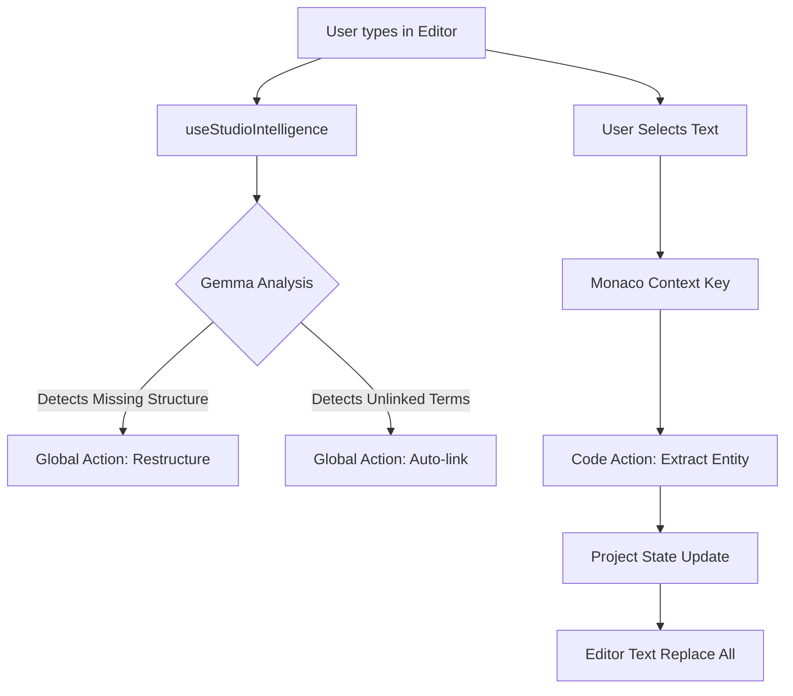

# Plan: Integrated Intelligent Editor Features

## Objective

Transform the Studio editor into a proactive, context-aware environment where AI features are embedded directly into the editing flow, replacing static buttons with dynamic, context-sensitive interventions.

## Core Philosophy

**"Context over Controls"**
Instead of the user searching for the right button ("Suggest Links"), the editor should analyze the content and offer the most relevant action for the current context (selection, cursor position, or whole document state).

## 1. UI/UX Architecture

### A. The "Smart Assistant" Indicator (Global Context)

Replaces static "Suggest" buttons.

- **Location**: Sticky header inside the Monaco Editor or a floating action button (FAB) in the bottom-right.
- **Behavior**:
  - **Idle**: Shows status "Gemma is analyzing..." -> "3 Suggestions".
  - **Active**: Clicking it opens a **"command palette"** of relevant global actions:
    - "Apply Standard Structure" (if structure is missing).
    - "Auto-link 12 detected entities" (if potential links found).
    - "Fix 2 logical inconsistencies" (if validation errors exist).

### B. Contextual Code Actions (Local Context)

Leverage Monaco's native **Lightbulb** (Code Actions) and **Context Menu**.

- **Trigger**: Selection or cursor placement.
- **Actions**:
  - **"Refactor Paragraph"**: Improve clarity, fix passive voice.
  - **"Extract to Entity"**: Convert selection to a new Competency/Skill/Concept.
  - **"Find & Link"**: Search for this term in the project and link it.

## 2. Feature Deep Dive

### Feature 1: "Extract & Link" (The Refactoring Flow)

**Scenario**: User types "The agent uses a *binary search* to find..."

1. User selects "binary search".
2. Right-click -> **"Extract to Concept"**.
3. **Flow**:
    - System checks if `@concept:binary_search` exists.
    - If not, opens a mini-dialog to create it (ID: `binary_search`, Name: `Binary Search`).
    - **Crucial Step**: System scans the *entire current document* for "binary search" (case-insensitive).
    - **Action**: Replaces all instances with `@concept:binary_search`.
    - **Result**: Validates the new entity exists in the project state.

### Feature 2: Dynamic Document Actions

**Scenario**: The user pastes a rough text blob.

1. **Analysis**: `useStudioIntelligence` detects missing `## ROLE` and `## OBJECTIVE`.
2. **Notification**: The Smart Assistant indicator pulses.
3. **Action**: User clicks "Apply Structure".
4. **Result**: AI rewrites the text to fit the standard Cognitive Markdown template, preserving the original content.

### Feature 3: Inline Autocomplete (Ghost Text)

**Scenario**: User types `- > ACTION: Retrieve`.

1. **AI Prediction**: "Retrieve records from @tool:database using query."
2. **UI**: Gray ghost text appears. Tab to accept.

## 3. Technical Implementation Plan

### Phase 1: Monaco Command Infrastructure

- **Component**: Extend `CognitiveMonacoEditor` to accept `codeActions`.
- **Hook**: Update `useStudioIntelligence` to return `actions` alongside `markers`.
- **UI**: Register `monaco.languages.registerCodeActionProvider`.

### Phase 2: The "Extract" Logic

- **State Management**: We need a way to *write* back to the Project State from within the Editor (creating new entities).
- **Search & Replace**: Implement a regex-based batch replacement utility within the editor model.

### Phase 3: The "Smart Assistant" UI

- **Layout**: Overlay a `Box` on top of the `CognitiveMonacoEditor` (top-right corner).
- **Interaction**: Connect it to the `actions` derived from `useStudioIntelligence`.

## 4. Proposed Data Flow

